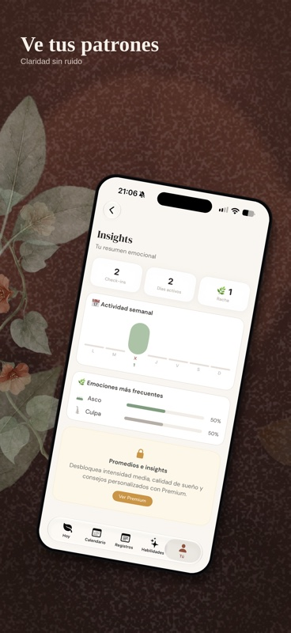
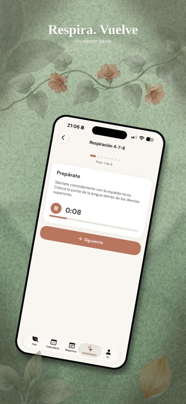
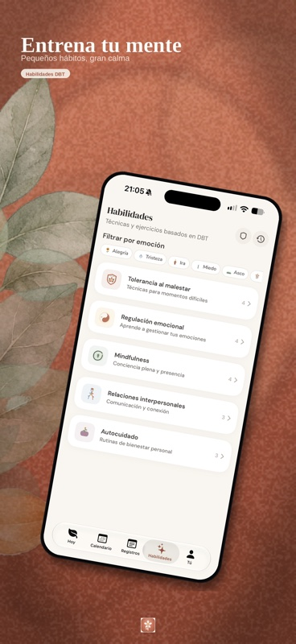
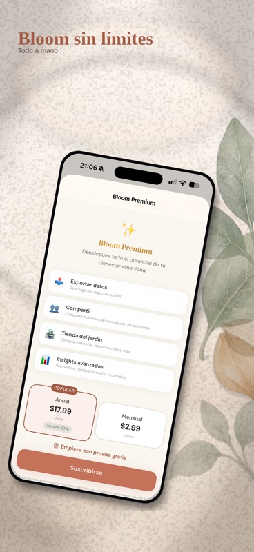

  

  
  

  <b>iOS Developer</b> in Valencia. By day, native iOS in production at <b>Mercadona</b>: employee-app flows for BLE access, payslips and office tasks. 
  By night, SwiftUI side projects and a blog about coding agents in Xcode.

---

## Bloom

**A native SwiftUI emotional journal for iOS 17+.** It started as a React Native prototype and was rewritten natively end to end: Firebase sync, StoreKit 2 subscriptions, Home Screen widgets and CryptoKit.
 

  
  
  
  

  
  
  
  
  

In App Store review · <a href="https://mariobelenguer.web.app">full case study on the portfolio →</a>

## Also building

- **[simcam](https://github.com/MarioB03/simcam)**: a fake camera for the iOS Simulator. It captures the desktop behind the Simulator window and injects it into the app's `AVFoundation` pipeline, so barcode and QR scanners work with no device and no app changes. Built with ScreenCaptureKit, Vision and Objective-C runtime swizzling.
- **[blog-ia-swift](https://github.com/MarioB03/blog-ia-swift)**: a blog about coding agents (Claude Code, Codex, Cursor) applied to Swift, SwiftUI and Xcode. Built with Astro.
- **[relicario](https://github.com/MarioB03/relicario)**: a PWA that recognises songs as you hear them and keeps them in a vinyl-style collection, a diary and a map.

## Toolbox

  
  
  
  
  
  
  
  
  
  

**How I build:** Clean Architecture · MVVM · async/await · `@Observable` · Swift Testing

---

Open to chatting about iOS, SwiftUI and building with coding agents · <a href="https://mariobelenguer.web.app">mariobelenguer.web.app</a>

